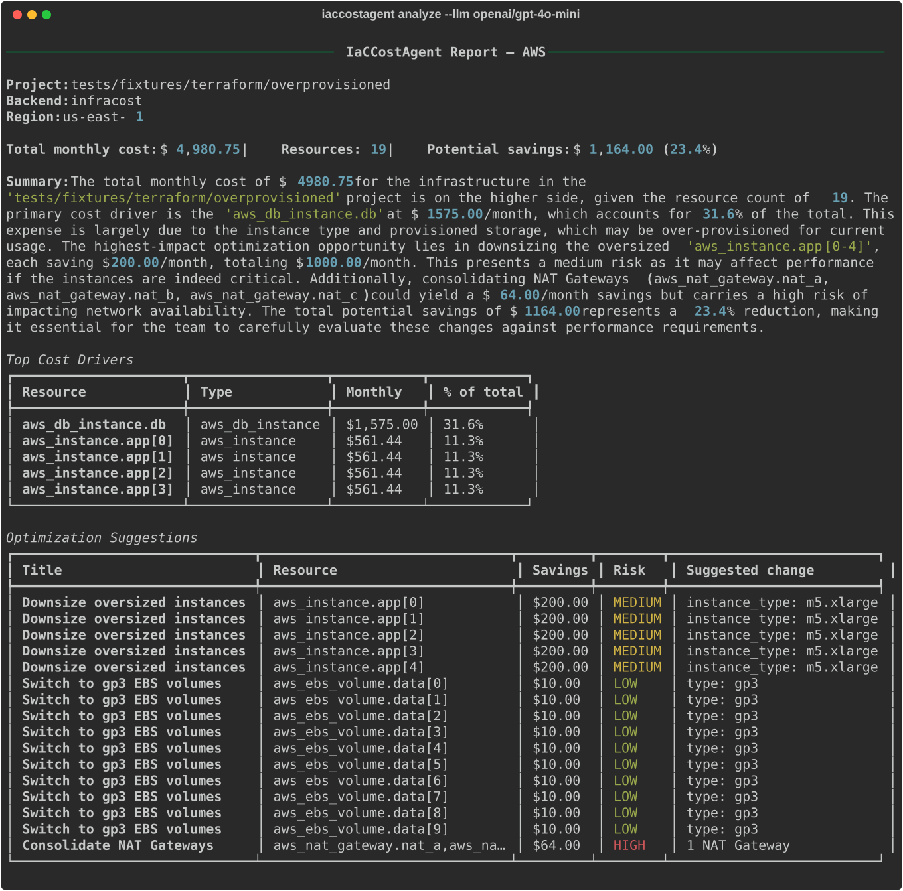
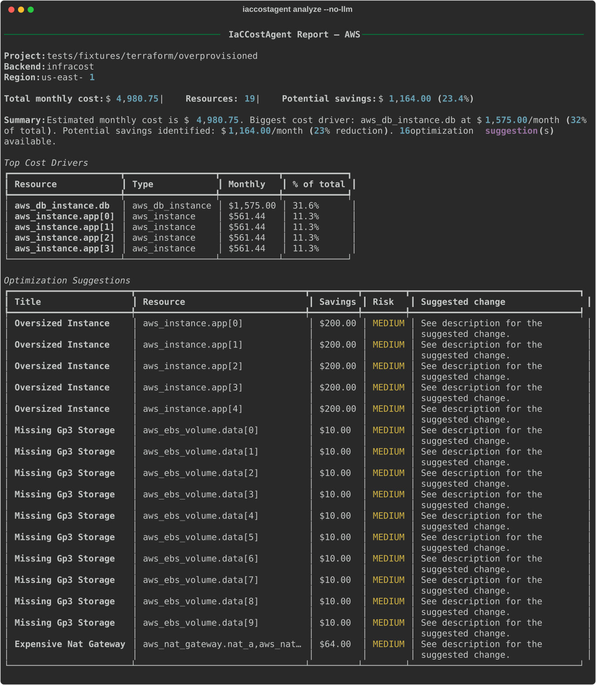

# IaCCostAgent

**AI-powered Terraform cost preview and optimization advisor** — know *why* your infrastructure is expensive and *what* to do about it, before you deploy.

[](https://github.com/chaubes/iaccostagent/actions/workflows/ci.yml)
[](https://www.python.org/downloads/)
[](LICENSE)

---

IaCCostAgent parses your Terraform (HCL or plan JSON), runs cost estimation via [Infracost](https://www.infracost.io/) or [OpenInfraQuote](https://github.com/terrateamio/openinfraquote), detects cost anti-patterns with a deterministic rule engine, and uses an LLM to produce plain-English explanations, risk-rated optimization suggestions, and PR-ready summaries.

Unlike raw cost tools that show numbers, IaCCostAgent answers: **"Why is this expensive, and what can I do about it?"**

## Demo

Both demos run the same command against the same fixture — `iaccostagent analyze tests/fixtures/terraform/overprovisioned --backend infracost --region us-east-1` — differing only in whether the LLM layer is active.

### With an LLM (OpenAI `gpt-4o-mini`)

The LLM produces a natural-language executive summary and refines each optimization with risk level + Terraform-specific implementation notes.



### Without an LLM (`--no-llm` / air-gapped)

Same cost numbers, same patterns detected — but the summary and suggestions fall back to the deterministic rule engine. No LLM contacted.



## Features

- **Terraform-native**: HCL files and Terraform plan JSON both supported
- **Wraps best-in-class backends**: Infracost (AWS, Azure, GCP) or OpenInfraQuote (AWS, fully local)
- **Rule engine**: Deterministic detection of oversized instances, old-generation types, gp2-vs-gp3, NAT-gateway sprawl, unattached EIPs
- **LLM-powered advice**: Plain-English explanations and risk-rated optimization suggestions
- **Local-first**: Runs entirely locally with Ollama — no API keys for LLM
- **Cloud LLM support**: Optional OpenAI integration
- **Multiple outputs**: Terminal (Rich), Markdown, JSON, GitHub PR comment
- **CI/CD ready**: `--max-cost` + `--fail-on-exceed` for cost gating
- **HTTP API**: FastAPI server mode for dashboards and integrations

## Quick Start

### Install

```bash
pip install iaccostagent
```

Or with [uv](https://docs.astral.sh/uv/):

```bash
uv tool install iaccostagent
```

### Install a cost backend

```bash
# Option A — Infracost (recommended, AWS/Azure/GCP)
brew install infracost
infracost auth login

# Option B — OpenInfraQuote (AWS-only, fully local)
brew install openinfraquote/tap/oiq
```

### Install Ollama (for local LLM)

```bash
brew install ollama        # macOS; Linux: curl -fsSL https://ollama.com/install.sh | sh
ollama pull qwen3:8b
```

### Run

```bash
# Analyze a local Terraform directory
iaccostagent analyze ./infrastructure

# Analyze a remote git repository (cloned automatically, cleaned up after)
iaccostagent analyze https://github.com/user/repo.git

# Remote repo where Terraform lives under a subdirectory
iaccostagent analyze https://github.com/user/repo.git --subdir infrastructure

# Use OpenInfraQuote against a plan JSON
iaccostagent analyze ./plan.json --backend openinfraquote --region us-east-1

# Fast cost only (no LLM, no pattern engine) — just the Infracost report
iaccostagent estimate ./infrastructure

# Full pipeline WITHOUT the LLM — rule-based patterns + deterministic report
# (useful for air-gapped environments or when you just want reproducible output)
iaccostagent analyze ./infrastructure --no-llm

# Diff two configurations (local or git URLs)
iaccostagent diff ./infra-v1 ./infra-v2

# Diff two repos with the same Terraform layout on both sides
iaccostagent diff \
  https://github.com/org/infra.git \
  https://github.com/org/infra-next.git \
  --subdir terraform

# Diff two repos with DIFFERENT layouts — use per-side subdirs
iaccostagent diff \
  https://github.com/org/legacy.git \
  https://github.com/org/modern.git \
  --before-subdir legacy_infra \
  --after-subdir terraform/prod

# CI/CD gating — fail if estimated monthly cost exceeds $5000
iaccostagent analyze ./infrastructure --max-cost 5000 --fail-on-exceed

# Cloud LLM instead of local Ollama
iaccostagent analyze ./infrastructure --llm openai/gpt-4o-mini
```

## Commands at a Glance

| Command | What it does | LLM? | Cost backend? | Typical use |
|---------|--------------|------|---------------|-------------|
| `analyze <path>` | Full pipeline: parse + cost + patterns + suggestions + summary | Yes (or `--no-llm`) | Yes | Day-to-day PR review, pre-deploy check |
| `estimate <path>` | Raw cost breakdown from the backend | No | Yes | Quick "how much will this cost?" answer |
| `diff <before> <after>` | Compares cost between two configurations | No | Yes | Before/after a refactor, v1 vs v2 |
| `check-backend` | Verifies binary + API key; `--verify` does an end-to-end smoke run | No | Optional | First run, CI health check |
| `serve` | Starts the FastAPI HTTP API | Optional | Yes (per request) | Team dashboards, integrations |
| `version` | Prints the installed version | No | No | Debugging |

All three of `analyze` / `estimate` / `diff` accept **local paths** *and* **git URLs** (https/ssh), with optional `--subdir` to drill into a Terraform subfolder. Git repos are shallow-cloned to a temp directory and deleted automatically when the command exits (even on error).

## CLI Reference

### `iaccostagent analyze`

Full LLM-powered pipeline: parse → estimate → detect → suggest → report.

```
Usage: iaccostagent analyze PATH [OPTIONS]

Arguments:
  PATH                    Terraform dir, .tf file, plan JSON, or git URL

Options:
  -b, --backend TEXT      Cost backend: infracost | openinfraquote | aws-pricing |
                          azure-retail | gcp-catalog [default: infracost]
  -r, --region TEXT       Cloud region (e.g., us-east-1)
  -l, --llm TEXT          LLM provider/model (default: ollama/qwen3:8b)
  --no-llm                Skip the LLM entirely. Produces a rule-based report.
  -f, --format TEXT       Output: terminal, markdown, json, github-comment
  -o, --output TEXT       Write output to file instead of stdout
  --input-format TEXT     Force input format: hcl or plan-json
  --subdir TEXT           For git URLs, analyze this subdirectory of the cloned repo
  --max-cost FLOAT        Threshold for --fail-on-exceed
  --fail-on-exceed        Exit code 1 if monthly cost exceeds --max-cost
  -v, --verbose           Show detailed progress
```

### `iaccostagent estimate`

Quick cost estimate only. No LLM, no pattern analysis. Accepts local paths and git URLs.

## Two "no-LLM" modes

Sometimes you want the cost numbers without any model in the loop — for compliance, speed, or because Ollama/OpenAI isn't reachable. There are two options:

| Command | What you get | Use it when |
|---------|--------------|-------------|
| `iaccostagent estimate` | Just the backend's cost breakdown table | You only want dollar numbers |
| `iaccostagent analyze --no-llm` | Cost + pattern detection + rule-based optimization suggestions + rule-based summary | You want the full report shape without a model |

If the LLM is configured but temporarily unreachable during a regular `analyze` run, the pipeline automatically falls back to the same rule-based path — so the report always arrives. `--no-llm` just makes that explicit and skips the failed LLM call.

### `iaccostagent diff`

Compare estimated costs between two Terraform configurations.

### `iaccostagent check-backend`

Verify the selected cost backend is installed and reachable.

```bash
# Binary + API key check
iaccostagent check-backend --backend infracost

# Full end-to-end verification: runs the backend on a tiny generated
# snippet and confirms a valid cost is returned.
iaccostagent check-backend --backend infracost --verify
```

`analyze`, `estimate`, and `diff` run the same pre-flight automatically, so missing binaries or API keys surface *before* the pipeline starts rather than mid-run.

### `iaccostagent serve`

Start the FastAPI HTTP server (requires `pip install iaccostagent[server]`).

## Supported Backends

Five backends ship with the tool; custom backends plug in via the [backend registry](#adding-a-backend).

| Backend | Providers | Coverage | Recommended for | Dependencies |
|---------|-----------|----------|-----------------|--------------|
| `infracost` | AWS, Azure, GCP | **Full** — 1,100+ resource types | **Production cost analysis** | Infracost CLI + free API key |
| `openinfraquote` | AWS | Full AWS coverage | **Air-gapped AWS environments** | OIQ CLI + pricesheet CSV |
| `aws-pricing` | AWS | Reference: `aws_instance`, `aws_ebs_volume`, `aws_nat_gateway`, `aws_db_instance` | **Reference / extension template** | None — uses public Price List JSON |
| `azure-retail` | Azure | Reference: Linux/Windows VMs, managed disks | **Reference / extension template** | None — uses public Retail Prices API |
| `gcp-catalog` | GCP | Reference: `google_compute_instance` | **Reference / extension template** | `GOOGLE_API_KEY` with Cloud Billing API |

### Which backend should I use?

> **For production cost analysis, use `--backend infracost`.** It has the broadest coverage, handles usage-based estimation, and is actively maintained. Our live parity tests confirm the native backends match Infracost to 0–5% per resource *for the types they cover*, but Infracost covers 100x more resource types.

The three native backends (`aws-pricing`, `azure-retail`, `gcp-catalog`) are **reference implementations** shipped to demonstrate the extension pattern described in [docs/adding-backends.md](docs/adding-backends.md). They query the cloud providers' own public pricing APIs directly — the data is authoritative, but the coverage is a deliberate starter subset. Anyone running the CLI with one of these backends sees an explicit warning to that effect.

Use a native backend when:

- You're **writing your own backend** and want a working template to copy.
- You need **zero external service dependencies** (no Infracost CLI, no paid API) for a narrow workload — e.g. a simple EC2+RDS+NAT-only shop.
- You want to **extend pricing coverage** for resources Infracost doesn't handle, or for a provider Infracost doesn't support yet.

Do **not** use a native backend when:

- You need accurate totals across a realistic mixed-service Terraform project. S3, CloudFront, Lambda, EKS, DynamoDB, App Service, Container Apps, Cloud Run, etc. aren't modeled.
- Your Terraform uses variable interpolation for pricing-relevant attributes (`instance_type = var.size`). Only Infracost runs Terraform's HCL evaluator.
- Anyone downstream will make billing or budget decisions from the numbers.

## Supported Cloud Resources (pattern engine)

The deterministic rule engine flags cost anti-patterns across all three clouds:

| Cloud | Rules shipped |
|-------|---------------|
| AWS | Oversized EC2, older-gen EC2/RDS, gp2→gp3 EBS, unattached EIPs, ≥3 NAT Gateways |
| Azure | Oversized VMs, older-gen VMs (pre-v2), Standard_LRS disks, deprecated PostgreSQL/MySQL single-servers, Standard static public IPs, ≥3 NAT Gateways |
| GCP | Oversized compute instances, older-gen (n1-/g1-/f1-), pd-standard disks, unassigned static IPs, ≥3 Cloud NATs |

See [docs/writing-patterns.md](docs/writing-patterns.md) for how to add your own.

<a id="adding-a-backend"></a>

## Adding a Backend

Subclass `CostBackend` and decorate with `@register_backend("my-cloud")`:

```python
from iaccostagent.backends.base import CostBackend
from iaccostagent.backends.registry import register_backend

@register_backend("my-cloud")
class MyCloudBackend(CostBackend):
    name = "my-cloud"

    def is_available(self) -> bool: ...
    async def estimate(self, terraform_path: str, region: str | None = None): ...
```

Once imported, `iaccostagent analyze ./tf --backend my-cloud` routes to it. See [docs/adding-backends.md](docs/adding-backends.md) for full walkthroughs including the three reference native backends.

## Architecture


Six-node LangGraph pipeline:

- **parse_terraform** — HCL or plan JSON → list of TerraformResources
- **estimate_costs** — Shell out to the chosen backend, normalize to CostEstimate
- **analyze_resources** — Merge parsed resource attributes with cost data
- **detect_patterns** — Deterministic rule engine → CostPatterns with dollar estimates
- **suggest_optimizations** — LLM enriches patterns into risk-rated suggestions (falls back to rule-based output if LLM fails)
- **generate_report** — LLM writes the executive summary and assembles the report

If no resources are parsed (empty project, unsupported provider), the graph short-circuits straight to `generate_report`. Built on [LangGraph](https://github.com/langchain-ai/langgraph) with a Typer CLI and optional FastAPI server.

## Data Handling & Privacy

Your Terraform **source files are never uploaded** by any backend. Here's the precise data-egress picture so you can evaluate this tool for regulated or compliance-sensitive environments.

### What each backend sends over the network

| Backend | Where parsing happens | What leaves your machine | Who receives it |
|---------|----------------------|---------------------------|-----------------|
| `infracost` | Locally (Infracost's own HCL evaluator) | Per-resource pricing attributes only (`instance_type`, `region`, `engine`, etc.) — not source files, names, tags, or variables | `pricing.api.infracost.io` (or your self-hosted CPAPI) |
| `openinfraquote` | Locally (OIQ's CLI) | **Nothing** — pricing comes from a CSV on disk | No one |
| `aws-pricing` | Locally (our `HCLParser`) | Nothing — only pulls AWS's public price-list JSON *into* your machine | `pricing.us-east-1.amazonaws.com` (download, no data uploaded) |
| `azure-retail` | Locally (our `HCLParser`) | Per-resource query (`skuName`, `armRegionName`, `serviceName`) | `prices.azure.com` (public Retail Prices API) |
| `gcp-catalog` | Locally (our `HCLParser`) | Per-resource query + your `GOOGLE_API_KEY` | `cloudbilling.googleapis.com` |

**What Infracost does NOT send** — the `.tf` source text, resource names/addresses, tags, variable values (unless a var value is itself a pricing attribute like `instance_type`), comments, locals, outputs, secrets embedded in the code, private IPs, or AMI IDs beyond what's needed for pricing. All of this is documented publicly in Infracost's FAQ:

- [Security and privacy overview](https://www.infracost.io/docs/faq/#security-and-privacy)
- [What data is sent to the Cloud Pricing API](https://www.infracost.io/docs/faq/#what-data-is-sent-to-the-cloud-pricing-api)
- [Does the CLI send the Terraform plan to the Cloud Pricing API?](https://www.infracost.io/docs/faq/#does-the-infracost-cli-send-the-terraform-plan-to-the-cloud-pricing-api)
- [Does Infracost need cloud credentials?](https://www.infracost.io/docs/faq/#does-infracost-need-cloud-credentials)
- [How to allowlist Infracost IP addresses](https://www.infracost.io/docs/faq/#how-can-i-allowlist-infracost-ip-addresses)

### What the LLM sees (distinct from the cost backend)

When you run `analyze` (not `estimate`), the two LLM nodes send a **summary of the parsed resources + cost numbers** to whichever LLM provider you configured:

- **Local LLM (Ollama)**: stays on your machine / your network.
- **Cloud LLM (OpenAI)**: prompt payload is sent to OpenAI per their data policy.

What's in the LLM prompt: resource addresses, resource types, instance types, sizes, monthly costs, detected anti-patterns. What's **not** in the prompt: your `.tf` source files, full tag values, variable values, secrets in comments.

Three ways to skip the LLM entirely: `iaccostagent estimate`, or `analyze --no-llm`, or configure a local Ollama model.

### Fully air-gapped recipes

Ordered by how much infrastructure you already have:

| Situation | Recipe | Egress |
|-----------|--------|--------|
| Just want to try it | `--backend openinfraquote --no-llm` (AWS only, needs pricesheet CSV) | **None** |
| AWS-only, enterprise-proxy-friendly | Same as above | **None** |
| Multi-cloud, trust Infracost | `--backend infracost --llm ollama/qwen3:8b` (local LLM) | Pricing attrs → Infracost only |
| Multi-cloud, no external egress allowed | Self-host Infracost CPAPI + Ollama (see below) | **None** |

### Self-hosting Infracost's Cloud Pricing API

For teams that want Infracost's multi-cloud coverage but zero data leaving their network:

1. **Contact Infracost for self-hosted access.** The self-hosted Cloud Pricing API (CPAPI) isn't a public download — it's currently distributed under Infracost's commercial / enterprise tier. Reach out via the links in the Infracost FAQ: [Does Infracost offer a self-hosted option?](https://www.infracost.io/docs/faq/) (search the page for "self-hosted") or email `hello@infracost.io`.
2. **Deploy the CPAPI container** they provide inside your network. It's a small API service backed by Postgres.
3. **Load the initial pricing dump** (Infracost provides one, accessed with your API key).
4. **Point iaccostagent at it:**
   ```bash
   export INFRACOST_PRICING_API_ENDPOINT=https://internal-cpapi.corp.example.com
   iaccostagent analyze ./tf --backend infracost --llm ollama/qwen3:8b
   ```
   This environment variable is read by Infracost's own CLI and redirects all pricing lookups to your internal endpoint. Zero external network calls once Ollama is the LLM.

**Keeping the pricing data fresh:** cloud prices change — AWS drops EC2 prices ~twice a year, Azure adds SKUs, GCP launches regions. Infracost publishes refreshed pricing data on a regular cadence. The usual operational model:

- Deploy the CPAPI container **once** (or update on CPAPI bugfix releases).
- Set up a **nightly or weekly cron** that pulls the latest pricing dump from Infracost and reloads Postgres — Infracost documents the update procedure for self-hosted customers. The update is fast (minutes) and non-disruptive.
- The container image itself rarely changes; only the *data* refreshes.

Rough operational effort once the cron is in place: near-zero monthly.

> **Note on verification:** the self-hosted CPAPI distribution URL has moved more than once over the years. Rather than hard-code a potentially stale link, we recommend reaching out to Infracost directly — they'll give you the current install docs, the correct container registry, and the update cadence tied to your contract.

### Opt out of Infracost telemetry

Even when using Infracost's hosted pricing API, you can disable their anonymous usage telemetry:

```bash
export INFRACOST_SELF_HOSTED_TELEMETRY=false
export INFRACOST_DISABLE_REPORT_ALL=true
```

(Put these in your `.env` if you're using our tool regularly.)

## Configuration

### Environment Variables

| Variable | Description | Default |
|----------|-------------|---------|
| `IACCOSTAGENT_LLM_PROVIDER` | LLM provider | `ollama` |
| `IACCOSTAGENT_LLM_MODEL` | LLM model name | `qwen3:8b` |
| `OLLAMA_BASE_URL` | Ollama server URL (for remote Ollama) | `http://localhost:11434` |
| `OPENAI_API_KEY` | OpenAI API key (if using OpenAI) | - |
| `INFRACOST_API_KEY` | Infracost API key (required for Infracost backend) | - |
| `INFRACOST_PRICING_API_ENDPOINT` | Self-hosted Infracost CPAPI endpoint (for air-gapped use) | - |
| `OIQ_PRICESHEET` | Path to OpenInfraQuote pricesheet CSV | - |
| `GOOGLE_API_KEY` | GCP API key with Cloud Billing API enabled (for `gcp-catalog` backend) | - |
| `IACCOSTAGENT_DEFAULT_REGION` | Default cloud region | - |
| `IACCOSTAGENT_CACHE_DIR` | Disk cache directory for native backends | `~/.cache/iaccostagent` |
| `LANGSMITH_TRACING` | Enable LangSmith tracing | - |
| `LANGSMITH_API_KEY` | LangSmith API key | - |
| `LANGSMITH_PROJECT` | LangSmith project name | - |

### CI/CD Integration

```yaml
name: Infrastructure Cost Review
on:
  pull_request:
    paths: ['infrastructure/**']

jobs:
  cost-review:
    runs-on: ubuntu-latest
    steps:
      - uses: actions/checkout@v4
      - uses: infracost/actions/setup@v3
        with:
          api-key: ${{ secrets.INFRACOST_API_KEY }}
      - run: pip install iaccostagent
      - run: |
          iaccostagent analyze ./infrastructure \
            --backend infracost \
            --llm openai/gpt-4o-mini \
            --format github-comment \
            --output cost-comment.md \
            --max-cost 5000 \
            --fail-on-exceed
        env:
          OPENAI_API_KEY: ${{ secrets.OPENAI_API_KEY }}
      - uses: peter-evans/create-or-update-comment@v4
        with:
          issue-number: ${{ github.event.pull_request.number }}
          body-path: cost-comment.md
```

See [docs/ci-cd-integration.md](docs/ci-cd-integration.md) for more examples.

## HTTP API

```bash
iaccostagent serve --port 8888

# Full analysis
curl -X POST http://localhost:8888/api/v1/analyze \
  -H "Content-Type: application/json" \
  -d '{"project_path": "/path/to/tf", "backend": "infracost"}'

# Fast estimate only
curl -X POST http://localhost:8888/api/v1/estimate \
  -H "Content-Type: application/json" \
  -d '{"project_path": "/path/to/tf"}'

# Health
curl http://localhost:8888/api/v1/health
```

## Development

```bash
git clone https://github.com/chaubes/iaccostagent.git
cd iaccostagent
uv sync --all-extras

make test-unit           # Fast, no network, no subprocess
make test-integration    # Needs infracost / oiq on PATH
make test-agent          # Graph compile; full pipeline needs Ollama
make lint && make typecheck
make run ARGS="analyze tests/fixtures/terraform/simple_web_app"
```

See [CONTRIBUTING.md](CONTRIBUTING.md) for the full guide.

## License

MIT License. See [LICENSE](LICENSE).
