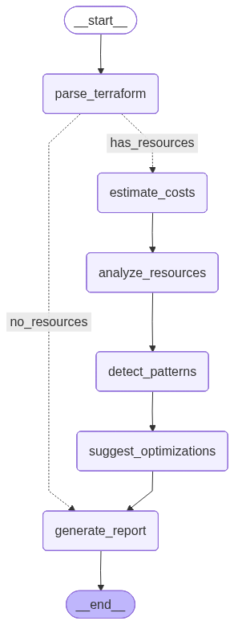

# Architecture

IaCCostAgent is a six-node LangGraph pipeline that turns Terraform input into a risk-rated cost analysis report.

## Pipeline



```
parse_terraform → [has_resources?] → estimate_costs → analyze_resources
                                                          ↓
                                                   detect_patterns
                                                          ↓
                                                 suggest_optimizations
                                                          ↓
                                                  generate_report → END
            [no_resources] ─────────────────────────────→ generate_report → END
```

The PNG above is produced directly from the compiled graph by LangGraph's mermaid renderer. Regenerate it any time the graph shape changes:

```bash
uv run python -c "from iaccostagent.agent.graph import build_graph; open('docs/graph.png','wb').write(build_graph().get_graph().draw_mermaid_png())"
```

### 1. `parse_terraform`

Pure Python. Reads either:
- A directory of `.tf` files via `python-hcl2`, or
- A Terraform plan JSON (`terraform show -json tfplan.binary`).

Emits a flat list of `TerraformResource` objects with attributes extracted, provider inferred from the resource-type prefix (`aws_*`, `azurerm_*`, `google_*`), and source-file metadata preserved for debugging.

### 2. `estimate_costs`

Calls the configured cost backend (Infracost or OpenInfraQuote) via a safe subprocess runner (`shell=False`, 120s default timeout). Normalizes the backend's JSON output into a unified `CostEstimate` with per-resource `ResourceCost` entries, cost components, and a total.

### 3. `analyze_resources`

Merges the parsed resource attributes back into the cost-backend output (the backend doesn't know about user-defined attributes) and fills in `percentage_of_total` on every `ResourceCost`.

### 4. `detect_patterns`

Deterministic rule engine in `patterns/rules.py`. Two rule shapes:
- **Single-resource rules** (oversized instance, older-gen, gp2 volume, unused EIP)
- **Collection rules** (≥3 NAT gateways)

Each rule emits a `CostPattern` with a description and a rough monthly dollar savings estimate. These rules never call the LLM.

### 5. `suggest_optimizations`

LLM node. Feeds the cost breakdown + detected patterns into the `OPTIMIZATION_ADVISOR_PROMPT` and parses the JSON response into `OptimizationSuggestion` objects. If the LLM fails or returns unparseable JSON, falls back to rule-derived suggestions so the pipeline still produces output.

### 6. `generate_report`

LLM node. Formats the top cost drivers + optimizations into `REPORT_GENERATION_PROMPT` and asks for a short executive summary. Falls back to a rule-based summary on LLM failure. Assembles the final `CostAnalysisReport`.

## Two-layer design

The rule engine is the ground truth for what's anti-patterned; the LLM explains and ranks. This means:
- Reports are consistent across runs even if LLM responses vary.
- The pipeline still produces value without an LLM.
- Adding a new detection is a single rule, not a prompt edit.

## Backends

Five backends ship: two are CLI wrappers (`infracost`, `openinfraquote`), three are native pricing-API implementations (`aws-pricing`, `azure-retail`, `gcp-catalog`). They all register themselves with `backends/registry.py` via `@register_backend(...)`. The CLI, the `estimate_costs` node, and the FastAPI server all resolve backends through `get_backend(name)` — so adding a sixth backend is a single registered class.

## Multi-cloud pattern engine

`patterns/rules.py` ships rules for **AWS**, **Azure**, and **GCP**, organized by provider section. Each rule is a short declarative dataclass with an `applies` predicate, a human-readable `describe` function, and a `estimate_savings` heuristic. Adding a new cloud provider is: add a section, declare rules, append them to `SINGLE_RESOURCE_RULES` / `COLLECTION_RULES`. See `docs/writing-patterns.md`.

## Extension points

- **New cost backend** — subclass `CostBackend`, add `@register_backend("name")`. See `docs/adding-backends.md`.
- **New pattern** — add to `SINGLE_RESOURCE_RULES` or `COLLECTION_RULES` in `patterns/rules.py`. See `docs/writing-patterns.md`.
- **New LLM provider** — extend `llm/provider.py:create_llm()`.
- **New output format** — add a formatter to `utils/output.py:FORMATTERS`.
